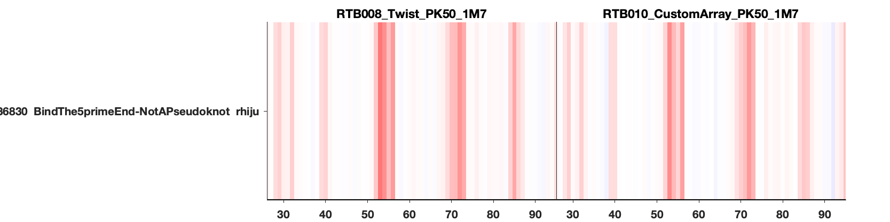
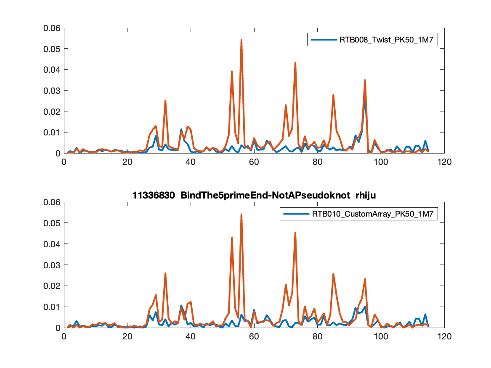

# Ubr (pronounced 'uber')

Ubr is a pipeline to process RNA chemical mapping with unique 3' barcodes for each RNA and mutational profiling

U = Ultraplex (for demultiplexing)
B = Bowtie2 (for alignment)
R = RNAFramework (for assigning mutations to chemical modification events)

(c) R. Das, Howard Hughes Medical Institute and Stanford University, 2023

Note: structure modeling & scoring scripts have mostly moved to https://github.com/eternagame/OpenKnotScore. 

## Requirements

You need *Python3*, and the following packages:

- `ultraplex 1.2.5`, available via `pip3 install ultraplex==1.2.5`. (Note: you'll need to use Python3.9, which may require virtualenv; make sure the env directory is in a directory without spaces in the name.)
- `bowtie2`, available via [conda](https://anaconda.org/bioconda/bowtie2) or [direct download](https://sourceforge.net/projects/bowtie-bio/files/bowtie2/2.5.1/) 
- `RNAFramework`, available from GitHub, with install directions [here](https://rnaframework-docs.readthedocs.io/en/latest/#installation).
- `bbmerge.sh`, available in [bbmap](https://sourceforge.net/projects/bbmap/) -- requires `java`.
- `seqkit`, available via [conda](https://anaconda.org/bioconda/seqkit) or [direct download](https://bioinf.shenwei.me/seqkit/download/)
- `samtools`, available for [download or github](http://www.htslib.org/)
- `MATLAB`, for final data processing and visualizing output. You'll need the Bioinformatics toolbox installed. (Ideally these last scripts should be ported to Python/matplotlib to increase accessibility.)

## Library expectations

The UBR data scripts assume the Illumina sequence inserts have the following form:

```
...GGGAACGACTCGAGTAGAGTCGAAAACATTCCCAAATTCCACCTTGGTGATGGCACCCGGAGAGGAGCCATCACCACACAAATTTCGATTTGTGAAAAGAAACAACAACAACAACTGTACATATACC
...<----- const 26 nts -----><-------- RNA of interest -----------------------><---barcode hp--->A<------Tail 2------><expbarcode>
```

Notes:

 * Above is in the sense direction of the RNA, and for historical reasons the Illumina Read 2 sequence is 5' of the sequence, and Illumina Read 1 is 3' of the sequence.
 * That means that Read 1 in the sequence is the *reverse complement* of the above.
 * The expbarcode is how experimental conditions (SHAPE, no modification, etc.) are barcoded. This is also historical, as early protocols from our lab were run on MiSeq kits that did not have i5/i7 based multiplexing.  This 12-nt barcode is not in the RNA, but added on with the cDNA primer during reverse transcription.
 * The sequences have a UUCG-tetraloop barcode hairpin at the 3' end. This unique identifier allows sequences to be identified in protocols like inline-seq that read out fragments of the RNA after degradation. In principle, these barcodes are not needed for mutational profiling.

## How UBR works

There are two major steps, each with several sub-steps. The overall workflow is as follows:

 * [Step 1. Process Illumina FASTQ data to get counts (command-line)](#step-1)
	 0. Merge Read 1 and Read 2 files.
	 1. Demultiplex based on the 12-nt expbarcode sequences in primer (Ultraplex)
	 2. Align reads to sequence library (Bowtie2) 
	 3. Assign mutation/deletion/insertion counts (RNAFramework)

 * [Step 2. Process counts to get & visualize reactivities (MATLAB)](#step-2)
	 1. Final reactivity processing, visualization (`quick_look_ubr` in matlab/)
	 2. RDAT output (output scripts in matlab/)

Each of these steps are illustrated with working examples below.

Below that are descriptions of two more advanced features: [merging UBR output](#merging-lanes) from multiple sequencer lanes and [subdividing](#subdividing-ubr-output-by-sublibraries) UBR output based on sublibraries.


## Example

### Step 1
**Process Illumina FASTQ data to get counts (command-line)**

The goal of this first of the two steps is to go from raw Illumina reads in FASTQ files to 'counts' files that count up each mutation. 

Following works through an example run that holds information on 2729 sequences from the Eterna OpenKnot Pilot "PK50" library. This RNA library was prepared from DNA pools ordered from both CustomArray/Genscript and Twist. The two RNA libraries were probed with the SHAPE reagent 1M7 and also, as controls for background subtraction, with mock treatment with DMSO.

There are two `FASTA`-formatted with the relvevant information.

 The four experimental conditions are encoded by 12-nt barcodes introduced during reverse transcription, which are encoded in the file `RTBbarcodes_PK50_RNA.fasta`:

```
>RTB008_Twist_PK50_1M7
GGTATATGTACA

>RTB010_CustomArray_PK50_1M7
ATGCATGCACAG

>RTB012_Twist_PK50_nomod
GCAAATGTGCTA

>RTB014_CustomArray_PK50_nomod
CTTTCCCACACT
```

And the 2729 sequences are in `pseudoknot50_puzzle_11318423.tsv.RNA_sequences.fa`:

```
>11459092	 I'm knot giving up	 Merida
GGGAACGACUCGAGUAGAGUCGAAAACAUUCCCAAAUUCCACCUUGGUGAUGGCACCCGGAGAGGAGCCAUCACCACACAAAUUUCGAUUUGUGAAAAGAAACAACAACAACAAC

>11459090	 Astros-pnote-11	 Astromon
GGGAACGACUCGAGUAGAGUCGAAAACGGUGCCAGUAUAGCGUAGCGCGGCGGUACACCGCCGAGCUGAGCUGGAAGAAGUAGUUCGCUACUUCAAAAGAAACAACAACAACAAC
...
```

The data are in MiSeq output FASTQ files for Read 1 and Read 2. (Note that in our standard run, we encode experimental conditions not in the i5/i7 regions but within the cDNA itself with the RTB primers.) 

For the example in this repo, 400,000 reads have been extracted from the middle of this file:

```
Sample1_S1_L001_R1_001_400k.fastq.gz
Sample1_S1_L001_R2_001_400k.fastq.gz
```

the full sequencing and example input/output are available at the [Google Drive link](https://drive.google.com/drive/folders/1U0ZFlZQ-NXnDy18TsvSxZo8pwM-lzV1N?usp=drive_link) described below.

There are three ways to run the first step of `UBR`, as (A) single processor run (good for testing), (B) multiple processor run (good for MiSeq-scale data), and (C) cluster run (with SLURM, necessary for large runs, e.g., NovaSeq).

#### Option 1A. Single processor run (good for testing)

These data files are available in `ubr_test`. Run the following command:

```
FASTQ_DIR=../data

ubr_run.py -s pseudoknot50_puzzle_11318423.tsv.RNA_sequences.fa  -b RTBbarcodes_PK50_RNA.fasta -1 $FASTQ_DIR/Sample1_S1_L001_R1_001_400k.fastq.gz -2 $FASTQ_DIR/Sample1_S1_L001_R2_001_400k.fastq.gz
```

(This command is also available in the `README_RUN` file, which you can run by typing `source README_RUN`.)

You should get:

```
Read in 2729 sequences from pseudoknot50_puzzle_11318423.tsv.RNA_sequences.fa.
Read in 4 primer barcodes from RTBbarcodes_PK50_RNA.fasta.
bbmerge.sh in=../data/Sample1_S1_L001_R1_001_400k.fastq.gz in2=../data/Sample1_S1_L001_R2_001_400k.fastq.gz out=../data/Sample1_S1_L001_R1_001_400k_MERGED.assembled.fastq.gz pigz=f unpigz=f > 0_merge_pairs.out 2> 0_merge_pairs.err

ultraplex -i ../data/Sample1_S1_L001_R1_001_400k_MERGED.assembled.fastq.gz -b primer_barcodes.csv  -d 1_ultraplex/  --dont_build_reference --ignore_no_match --threads 1 > 1_ultraplex/1_ultraplex.out 2> 1_ultraplex/1_ultraplex.err

bowtie2-build seq.fasta 2_bowtie2/bowtie-build/seq --threads 1 > 2_bowtie2/bowtie-build/bt2.out 2> 2_bowtie2/bowtie-build/bt2.err
bowtie2 --end-to-end --sensitive --maxins=800 --ignore-quals --no-unal --mp 3,1 --rdg 5,1 --rfg 5,1 --dpad 30 -x 2_bowtie2/bowtie-build/seq  -U 1_ultraplex/ultraplex_demux_5bc_GGTATATGTACA.fastq.gz -S 2_bowtie2/RTB008_Twist_PK50_1M7/bowtie2.sam --threads 1  > 2_bowtie2/RTB008_Twist_PK50_1M7/bowtie2.out 2> 2_bowtie2/RTB008_Twist_PK50_1M7/bowtie2.err
bowtie2 --end-to-end --sensitive --maxins=800 --ignore-quals --no-unal --mp 3,1 --rdg 5,1 --rfg 5,1 --dpad 30 -x 2_bowtie2/bowtie-build/seq  -U 1_ultraplex/ultraplex_demux_5bc_ATGCATGCACAG.fastq.gz -S 2_bowtie2/RTB010_CustomArray_PK50_1M7/bowtie2.sam --threads 1  > 2_bowtie2/RTB010_CustomArray_PK50_1M7/bowtie2.out 2> 2_bowtie2/RTB010_CustomArray_PK50_1M7/bowtie2.err
bowtie2 --end-to-end --sensitive --maxins=800 --ignore-quals --no-unal --mp 3,1 --rdg 5,1 --rfg 5,1 --dpad 30 -x 2_bowtie2/bowtie-build/seq  -U 1_ultraplex/ultraplex_demux_5bc_GCAAATGTGCTA.fastq.gz -S 2_bowtie2/RTB012_Twist_PK50_nomod/bowtie2.sam --threads 1  > 2_bowtie2/RTB012_Twist_PK50_nomod/bowtie2.out 2> 2_bowtie2/RTB012_Twist_PK50_nomod/bowtie2.err
bowtie2 --end-to-end --sensitive --maxins=800 --ignore-quals --no-unal --mp 3,1 --rdg 5,1 --rfg 5,1 --dpad 30 -x 2_bowtie2/bowtie-build/seq  -U 1_ultraplex/ultraplex_demux_5bc_CTTTCCCACACT.fastq.gz -S 2_bowtie2/RTB014_CustomArray_PK50_nomod/bowtie2.sam --threads 1  > 2_bowtie2/RTB014_CustomArray_PK50_nomod/bowtie2.out 2> 2_bowtie2/RTB014_CustomArray_PK50_nomod/bowtie2.err

rf-count --processors 1 -wt 1 -fast -f seq.fasta -m -cc -rd -ni -ds 1  -orc  -o 3_rf_count/RTB008_Twist_PK50_1M7 2_bowtie2/RTB008_Twist_PK50_1M7//bowtie2.sam >> 3_rf_count/rf-count_RTB008_Twist_PK50_1M7.out 2>> 3_rf_count/rf-count_RTB008_Twist_PK50_1M7.err
gzip 3_rf_count/RTB008_Twist_PK50_1M7/raw_counts/bowtie2.txt
rf-count --processors 1 -wt 1 -fast -f seq.fasta -m -cc -rd -ni -ds 1  -orc  -o 3_rf_count/RTB010_CustomArray_PK50_1M7 2_bowtie2/RTB010_CustomArray_PK50_1M7//bowtie2.sam >> 3_rf_count/rf-count_RTB010_CustomArray_PK50_1M7.out 2>> 3_rf_count/rf-count_RTB010_CustomArray_PK50_1M7.err
gzip 3_rf_count/RTB010_CustomArray_PK50_1M7/raw_counts/bowtie2.txt
rf-count --processors 1 -wt 1 -fast -f seq.fasta -m -cc -rd -ni -ds 1  -orc  -o 3_rf_count/RTB012_Twist_PK50_nomod 2_bowtie2/RTB012_Twist_PK50_nomod//bowtie2.sam >> 3_rf_count/rf-count_RTB012_Twist_PK50_nomod.out 2>> 3_rf_count/rf-count_RTB012_Twist_PK50_nomod.err
gzip 3_rf_count/RTB012_Twist_PK50_nomod/raw_counts/bowtie2.txt
rf-count --processors 1 -wt 1 -fast -f seq.fasta -m -cc -rd -ni -ds 1  -orc  -o 3_rf_count/RTB014_CustomArray_PK50_nomod 2_bowtie2/RTB014_CustomArray_PK50_nomod//bowtie2.sam >> 3_rf_count/rf-count_RTB014_CustomArray_PK50_nomod.out 2>> 3_rf_count/rf-count_RTB014_CustomArray_PK50_nomod.err
gzip 3_rf_count/RTB014_CustomArray_PK50_nomod/raw_counts/bowtie2.txt

rf-rctools view 3_rf_count/RTB008_Twist_PK50_1M7/bowtie2.rc > 4_rctools/RTB008_Twist_PK50_1M7/rf_count.csv && gzip 4_rctools/RTB008_Twist_PK50_1M7/rf_count.csv
rf-rctools view 3_rf_count/RTB010_CustomArray_PK50_1M7/bowtie2.rc > 4_rctools/RTB010_CustomArray_PK50_1M7/rf_count.csv && gzip 4_rctools/RTB010_CustomArray_PK50_1M7/rf_count.csv
rf-rctools view 3_rf_count/RTB012_Twist_PK50_nomod/bowtie2.rc > 4_rctools/RTB012_Twist_PK50_nomod/rf_count.csv && gzip 4_rctools/RTB012_Twist_PK50_nomod/rf_count.csv
rf-rctools view 3_rf_count/RTB014_CustomArray_PK50_nomod/bowtie2.rc > 4_rctools/RTB014_CustomArray_PK50_nomod/rf_count.csv && gzip 4_rctools/RTB014_CustomArray_PK50_nomod/rf_count.csv

Created: RTB008_Twist_PK50_1M7.muts.txt.gz and RTB008_Twist_PK50_1M7.coverage.txt.gz for 2729 sequences with total coverage 44495
Created: RTB010_CustomArray_PK50_1M7.muts.txt.gz and RTB010_CustomArray_PK50_1M7.coverage.txt.gz for 2729 sequences with total coverage 39888
Created: RTB012_Twist_PK50_nomod.muts.txt.gz and RTB012_Twist_PK50_nomod.coverage.txt.gz for 2729 sequences with total coverage 34820
Created: RTB014_CustomArray_PK50_nomod.muts.txt.gz and RTB014_CustomArray_PK50_nomod.coverage.txt.gz for 2729 sequences with total coverage 32928

Created raw_counts/RTB008_Twist_PK50_1M7.AC.txt.gz,raw_counts/RTB008_Twist_PK50_1M7.AG.txt.gz,raw_counts/RTB008_Twist_PK50_1M7.AT.txt.gz,raw_counts/RTB008_Twist_PK50_1M7.CA.txt.gz,raw_counts/RTB008_Twist_PK50_1M7.CG.txt.gz,raw_counts/RTB008_Twist_PK50_1M7.CT.txt.gz,raw_counts/RTB008_Twist_PK50_1M7.GA.txt.gz,raw_counts/RTB008_Twist_PK50_1M7.GC.txt.gz,raw_counts/RTB008_Twist_PK50_1M7.GT.txt.gz,raw_counts/RTB008_Twist_PK50_1M7.TA.txt.gz,raw_counts/RTB008_Twist_PK50_1M7.TC.txt.gz,raw_counts/RTB008_Twist_PK50_1M7.TG.txt.gz,raw_counts/RTB008_Twist_PK50_1M7.ins.txt.gz,raw_counts/RTB008_Twist_PK50_1M7.del.txt.gz for 2729 sequences (found 2319 designs)
Created raw_counts/RTB010_CustomArray_PK50_1M7.AC.txt.gz,raw_counts/RTB010_CustomArray_PK50_1M7.AG.txt.gz,raw_counts/RTB010_CustomArray_PK50_1M7.AT.txt.gz,raw_counts/RTB010_CustomArray_PK50_1M7.CA.txt.gz,raw_counts/RTB010_CustomArray_PK50_1M7.CG.txt.gz,raw_counts/RTB010_CustomArray_PK50_1M7.CT.txt.gz,raw_counts/RTB010_CustomArray_PK50_1M7.GA.txt.gz,raw_counts/RTB010_CustomArray_PK50_1M7.GC.txt.gz,raw_counts/RTB010_CustomArray_PK50_1M7.GT.txt.gz,raw_counts/RTB010_CustomArray_PK50_1M7.TA.txt.gz,raw_counts/RTB010_CustomArray_PK50_1M7.TC.txt.gz,raw_counts/RTB010_CustomArray_PK50_1M7.TG.txt.gz,raw_counts/RTB010_CustomArray_PK50_1M7.ins.txt.gz,raw_counts/RTB010_CustomArray_PK50_1M7.del.txt.gz for 2729 sequences (found 2559 designs)
Created raw_counts/RTB012_Twist_PK50_nomod.AC.txt.gz,raw_counts/RTB012_Twist_PK50_nomod.AG.txt.gz,raw_counts/RTB012_Twist_PK50_nomod.AT.txt.gz,raw_counts/RTB012_Twist_PK50_nomod.CA.txt.gz,raw_counts/RTB012_Twist_PK50_nomod.CG.txt.gz,raw_counts/RTB012_Twist_PK50_nomod.CT.txt.gz,raw_counts/RTB012_Twist_PK50_nomod.GA.txt.gz,raw_counts/RTB012_Twist_PK50_nomod.GC.txt.gz,raw_counts/RTB012_Twist_PK50_nomod.GT.txt.gz,raw_counts/RTB012_Twist_PK50_nomod.TA.txt.gz,raw_counts/RTB012_Twist_PK50_nomod.TC.txt.gz,raw_counts/RTB012_Twist_PK50_nomod.TG.txt.gz,raw_counts/RTB012_Twist_PK50_nomod.ins.txt.gz,raw_counts/RTB012_Twist_PK50_nomod.del.txt.gz for 2729 sequences (found 2275 designs)
Created raw_counts/RTB014_CustomArray_PK50_nomod.AC.txt.gz,raw_counts/RTB014_CustomArray_PK50_nomod.AG.txt.gz,raw_counts/RTB014_CustomArray_PK50_nomod.AT.txt.gz,raw_counts/RTB014_CustomArray_PK50_nomod.CA.txt.gz,raw_counts/RTB014_CustomArray_PK50_nomod.CG.txt.gz,raw_counts/RTB014_CustomArray_PK50_nomod.CT.txt.gz,raw_counts/RTB014_CustomArray_PK50_nomod.GA.txt.gz,raw_counts/RTB014_CustomArray_PK50_nomod.GC.txt.gz,raw_counts/RTB014_CustomArray_PK50_nomod.GT.txt.gz,raw_counts/RTB014_CustomArray_PK50_nomod.TA.txt.gz,raw_counts/RTB014_CustomArray_PK50_nomod.TC.txt.gz,raw_counts/RTB014_CustomArray_PK50_nomod.TG.txt.gz,raw_counts/RTB014_CustomArray_PK50_nomod.ins.txt.gz,raw_counts/RTB014_CustomArray_PK50_nomod.del.txt.gz for 2729 sequences (found 2549 designs)

Timings:
0_merge_pairs 00:00:03
1_ultraplex   00:00:07
2_bowtie2     00:01:43
3_rf_count    00:00:34
4_rctools     00:00:02
Final merge   00:00:01

Total time: 00:02:32
```

The files you need are the `.txt.gz` files that show up in the directory as well as in the `raw_counts/` subdirectory. 

These are simple comma-separated text files which contain one line per sequence (2729 sequences) with integers as follows:

 * `RTB012...`, `RTB014..` tags are primer names, given in the primer file (`RTBbarcodes_PK50_RNA.fasta`).
 * The files represent:
 	* `muts` - number of mutations detected at each position, including deletions (assigned to the right most position of ambiguous homonucleotide stretches).
 	* `coverage` - number of sequencing reads detected at each position
	* `ins`, `del` - number of insertions and deletions detected at each position
	*  `AC`, `AT`, - number of each kind of mutation detected at each position.

Example output is available in the directory `example/EXAMPLE_OUTPUT/ubr_test/`.

These files are what you need for the next step, (see **Step 2** below). 

#### Option 1B. Multiple processors on one node. (Fine for MiSeq)

The above data processing step is efficient for, say, 400,000 lines but becomes slow when processing 15-30M reads for a MiSeq. At that scale, it's more efficient to pre-split the FASTQ into several partitions on which `ubr_run.py` can be run in parallel. 

For preparing that split and the separate run directories, we can run `ubr_split.py`.

An example is given in `example/ubr_test_split`. In that directory, run:

```
FASTQ_DIR=../data

ubr_split.py -q 100000 -s pseudoknot50_puzzle_11318423.tsv.RNA_sequences.fa  -b RTBbarcodes_PK50_RNA.fasta -1 $FASTQ_DIR/Sample1_S1_L001_R1_001_400k.fastq.gz -2 $FASTQ_DIR/Sample1_S1_L001_R2_001_400k.fastq.gz
```

(This command-line is also available in `README_SPLIT`, which you can run with `source README_SPLIT`.)

Output should look like:

```
Read in 2729 sequences from pseudoknot50_puzzle_11318423.tsv.RNA_sequences.fa.
Read in 4 primer barcodes from RTBbarcodes_PK50_RNA.fasta.

seqkit split2 -s 100000 -1 ../data/Sample1_S1_L001_R1_001_400k.fastq.gz -2 ../data/Sample1_S1_L001_R2_001_400k.fastq.gz -O UBR --threads 12
[INFO] flag -1/--read1 and -2/--read2 given, ignore: -
[INFO] split seqs from ../data/Sample1_S1_L001_R1_001_400k.fastq.gz and ../data/Sample1_S1_L001_R2_001_400k.fastq.gz
[INFO] split into 100000 seqs per file
[INFO] write 100000 sequences to file: UBR/Sample1_S1_L001_R1_001_400k.part_001.fastq.gz
[INFO] write 100000 sequences to file: UBR/Sample1_S1_L001_R2_001_400k.part_001.fastq.gz
[INFO] write 100000 sequences to file: UBR/Sample1_S1_L001_R2_001_400k.part_002.fastq.gz
[INFO] write 100000 sequences to file: UBR/Sample1_S1_L001_R1_001_400k.part_002.fastq.gz
[INFO] write 100000 sequences to file: UBR/Sample1_S1_L001_R1_001_400k.part_003.fastq.gz
[INFO] write 100000 sequences to file: UBR/Sample1_S1_L001_R2_001_400k.part_003.fastq.gz
[INFO] write 100000 sequences to file: UBR/Sample1_S1_L001_R1_001_400k.part_004.fastq.gz
[INFO] write 100000 sequences to file: UBR/Sample1_S1_L001_R2_001_400k.part_004.fastq.gz

Timings:
seqkit split2 00:00:00
file mv/cp    00:00:00

Total time: 00:00:00


All 4 commands can be run with:
 source all_commands.sh

Or you can go into each subdirectory of UBR/ and run:
 source ubr_run.sh

Or to queue up 1 slurm jobs on sherlock you can run:
 source sbatch_commands.sh
```

You can look at the command-lines of the four `ubr_run.py` jobs that need to be queued up by typing `cat all_commands.sh`. You should see:

```
ubr_run.py -s UBR/001/pseudoknot50_puzzle_11318423.tsv.RNA_sequences.fa -b UBR/001/RTBbarcodes_PK50_RNA.fasta -1 UBR/001/Sample1_S1_L001_R1_001_400k.part_001.fastq.gz -2 UBR/001/Sample1_S1_L001_R2_001_400k.part_001.fastq.gz -O UBR/001 > UBR/001/ubr_run.out 2> UBR/001/ubr_run.err &
ubr_run.py -s UBR/002/pseudoknot50_puzzle_11318423.tsv.RNA_sequences.fa -b UBR/002/RTBbarcodes_PK50_RNA.fasta -1 UBR/002/Sample1_S1_L001_R1_001_400k.part_002.fastq.gz -2 UBR/002/Sample1_S1_L001_R2_001_400k.part_002.fastq.gz -O UBR/002 > UBR/002/ubr_run.out 2> UBR/002/ubr_run.err &
ubr_run.py -s UBR/003/pseudoknot50_puzzle_11318423.tsv.RNA_sequences.fa -b UBR/003/RTBbarcodes_PK50_RNA.fasta -1 UBR/003/Sample1_S1_L001_R1_001_400k.part_003.fastq.gz -2 UBR/003/Sample1_S1_L001_R2_001_400k.part_003.fastq.gz -O UBR/003 > UBR/003/ubr_run.out 2> UBR/003/ubr_run.err &
ubr_run.py -s UBR/004/pseudoknot50_puzzle_11318423.tsv.RNA_sequences.fa -b UBR/004/RTBbarcodes_PK50_RNA.fasta -1 UBR/004/Sample1_S1_L001_R1_001_400k.part_004.fastq.gz -2 UBR/004/Sample1_S1_L001_R2_001_400k.part_004.fastq.gz -O UBR/004 > UBR/004/ubr_run.out 2> UBR/004/ubr_run.err &
```

If you're runnig on a computer that can run at least 4 threads, then go ahead and type:

```
source all_commands.sh 
```

You'll see four processes queue up, which you can monitor with, e.g., `top`. You'll see files show up in the subdirectories `UBR/001`,...`UBR/004`.

Or you can look at the log files:

```
tail -f UBR/001/ubr_run.out
```
When jobs are done, the end of the file will report timings, e.g.:

```
Timings:
0_merge_pairs 00:00:03
1_ultraplex   00:00:02
2_bowtie2     00:00:28
3_rf_count    00:00:15
4_rctools     00:00:02
Final merge   00:00:01

Total time: 00:00:53
```

To collate counts from the four runs on the four splits, now type:

```
ubr_merge.py UBR
```

Output will be:

```
['UBR/*/']

Will merge:
RTB008_Twist_PK50_1M7.coverage.txt.gz
RTB010_CustomArray_PK50_1M7.coverage.txt.gz
RTB012_Twist_PK50_nomod.coverage.txt.gz
...
RTB014_CustomArray_PK50_nomod.ins.txt.gz
RTB008_Twist_PK50_1M7.del.txt.gz
RTB010_CustomArray_PK50_1M7.del.txt.gz
RTB012_Twist_PK50_nomod.del.txt.gz
RTB014_CustomArray_PK50_nomod.del.txt.gz
Compiled    44495 total counts for   2729 sequences from      4 of      4 files into: RTB008_Twist_PK50_1M7.coverage.txt.gz
Compiled    39888 total counts for   2729 sequences from      4 of      4 files into: RTB010_CustomArray_PK50_1M7.coverage.txt.gz
Compiled    34820 total counts for   2729 sequences from      4 of      4 files into: RTB012_Twist_PK50_nomod.coverage.txt.gz
Compiled    32928 total counts for   2729 sequences from      4 of      4 files into: RTB014_CustomArray_PK50_nomod.coverage.txt.gz
Compiled     4514 total counts for   2729 sequences from      4 of      4 files into: RTB008_Twist_PK50_1M7.muts.txt.gz
Compiled     5044 total counts for   2729 sequences from      4 of      4 files into: RTB010_CustomArray_PK50_1M7.muts.txt.gz
Compiled     2634 total counts for   2729 sequences from      4 of      4 files into: RTB012_Twist_PK50_nomod.muts.txt.gz
...
Compiled     2889 total counts for   2729 sequences from      4 of      4 files into: raw_counts/RTB012_Twist_PK50_nomod.ins.txt.gz
Compiled     3309 total counts for   2729 sequences from      4 of      4 files into: raw_counts/RTB014_CustomArray_PK50_nomod.ins.txt.gz
Compiled     3200 total counts for   2729 sequences from      4 of      4 files into: raw_counts/RTB008_Twist_PK50_1M7.del.txt.gz
Compiled     3792 total counts for   2729 sequences from      4 of      4 files into: raw_counts/RTB010_CustomArray_PK50_1M7.del.txt.gz
Compiled      885 total counts for   2729 sequences from      4 of      4 files into: raw_counts/RTB012_Twist_PK50_nomod.del.txt.gz
Compiled     2356 total counts for   2729 sequences from      4 of      4 files into: raw_counts/RTB014_CustomArray_PK50_nomod.del.txt.gz

Timings:
Read in data: 00:00:02
Output  data: 00:00:02

Total time: 00:00:05
```

Again, note that the above example is for 400,000 reads, split into 4 partitions of 100,000 reads. 

In actuality, a MiSeq run will produce 15-30M reads, which you'll want to partition into, say,  8 splits of 2M-4M reads each, by providing an option like `-q 2000000` to `ubr_split.py` above. It would then take roughly 10-30 mins to run each split on one thread on a typical desktop.  

Example output is available in the directory `example/EXAMPLE_OUTPUT/ubr_test_split/`.

#### Option 1C. Cluster runs (SLURM; needed for NovaSeq scale runs)

For NovaSeq runs (1B-8B reads), you'll likely need to do a cluster run. 

The data for a full example directory, even for a Miseq, is too big to store in a GitHub repo, but the example data are available in this [Google Drive folder](https://drive.google.com/drive/folders/1U0ZFlZQ-NXnDy18TsvSxZo8pwM-lzV1N?usp=drive_link). 

Download those data, and put the files in the `example/data_full/` directory.

Then, go into `example/ubr_full`.  The `ubr_split.py` command is provided in `run_ubr_split.sh`, which contains:

```
#!/bin/bash
#SBATCH --job-name=ubr_split
#SBATCH --output=ubr_split.out
#SBATCH --error=ubr_split.err
#SBATCH --partition=biochem,owners
#SBATCH --time=48:00:00
#SBATCH --cpus-per-task=12
#SBATCH --mem=24G

FASTQ_DIR=../data_full

ubr_split.py -q 1000000 -s pseudoknot50_puzzle_11318423.tsv.RNA_sequences.fa  -b RTBbarcodes_PK50_RNA.fasta -1 $FASTQ_DIR/Sample1_S1_L001_R1_001.fastq.gz -2 $FASTQ_DIR/Sample1_S1_L001_R2_001.fastq.gz

echo "DONE"
```

This is set up with appropriate parameters for SLURM to run on Stanford's Sherlock cluster, asking for a node from the `biochem,owners` partition -- you may need to edit that line to point to the partitions on which you have access. 

You can queue up the `ubr_split` command if you're on a SLURM cluster, by typing:

```
sbatch run_ubr_split.sh
```

That can take a while. For this example, it actually doesn't take long to run the split (only 5 minutes), so you can also just directly run the command with `sh run_ubr_split.sh`. However, for big jobs (e.g., NovaSeq), the split can take 24 hrs. It's best to not hog a login node to do the split, or to risk a timeout, so in those cases, use `sbatch` to queue up the job.

The splits are 1M reads per job and in this case leads to 18 partitions, since the starting Miseq run has 17,312,190 reads.

After the `ubr_split.py` completes (look for `DONE` to show up in the out file!), you can run the jobs on slurm with:

```
source sbatch_commands.sh
```

This runs one or more batches of jobs in which 24 `ubr_run.py` jobs will be run on each node.  Monitor as above, looking inside `ubr_run.out` files in the `UBR/*/` subdirectories.

When done, you can run `ubr_merge.py UBR/`. That can take a super long time if you have a lot of subdirectories, in which case type:

```
ubr_merge.py UBR -s
```

This will trigger the definition of a bunch of parallel jobs which will collate each of the `*.txt.gz` counts files in separate threads. Example output below:

```
['UBR/*/']

Will merge:
RTB008_Twist_PK50_1M7.coverage.txt.gz
RTB010_CustomArray_PK50_1M7.coverage.txt.gz
...
RTB008_Twist_PK50_1M7.del.txt.gz
RTB010_CustomArray_PK50_1M7.del.txt.gz
RTB012_Twist_PK50_nomod.del.txt.gz
RTB014_CustomArray_PK50_nomod.del.txt.gz

Created 4 slurm files containing 64 commands. Run:
 source sbatch_merge_commands.sh

```

Go ahead and queue up the `ubr_merge.py` jobs with `sbatch ubr_merge_commands.sh`.

In the end, you should have the `.txt.gz` files in the `ubr_full` example directory and the `raw_counts/` subdirectory.

The core data that need to be saved -- ideally transferred from the cluster to a laptop/desktop, which should be synced to Drive/Box/DropBox -- are the files in the directory without the massive `UBR` subdirectory. That's where you can run step 2.

Example output (*not* including the UBR subdirectories) is in `example/EXAMPLE_OUTPUT/ubr_full/`. Full example output is available at the [Google Drive link]().


### Step 2
**Process counts to get & visualize reactivities (MATLAB)**

The last step of the pipeline is to infer reactivity profiles, normalize the reactivities, and output final data files.  The final data files here are text file in the `RDAT` format which holds data and errors in `REACTIVITY` and `REACTIVITY_ERROR` lines as well as metadata related to sequence names, modifiers, etc. in headers. This is the data format used in the [RNA mapping database](https://rmdb.stanford.edu) and can be processed using either MATLAB or Python scripts with the [RDATkit](https://github.com/ribokit/RDATKit) package.

These steps could be carried out in, e.g., `RNAframework` or other code bases, but as part of UBR development, some of the steps have been revisited. One key innovation (to be described, manuscript in prep.) is to better handle deletion signals in SHAPE data sets. These signals are normally ambiguous in homonucleotide stretches -- we don't know which nucleotide was modified when there's a deletion in the stretch -- but we can take advantage of the distribution of non-deletion mutations to figure out how to distribute these deletions.

All of the data sets are currently captured in a MATLAB script called `quick_look_ubr`. 

The appropriate commands, which can be found in `example/ubr_test/extract_profiles.m` or similar are:

```
%%%%%%%%%%%%%%%%%%%%%%%%%%%%%%%%%%%%%%%%%%%%%%%%%%%%%%%%
%% Read in data
%%%%%%%%%%%%%%%%%%%%%%%%%%%%%%%%%%%%%%%%%%%%%%%%%%%%%%%%
filedir = './';
shape_nomod_idx = { ...
    {'RTB008_Twist_PK50_1M7','RTB012_Twist_PK50_nomod'},...
    {'RTB010_CustomArray_PK50_1M7','RTB014_CustomArray_PK50_nomod'},...
    };
sequence_file = 'pseudoknot50_puzzle_11318423.tsv.RNA_sequences.fa';
structure_csv_file = '';
d = quick_look_ubr(filedir,sequence_file,shape_nomod_idx,structure_csv_file);
save workspace_PK50_example.mat;
```

To run these:
 * Open MATLAB
 * Make sure to add the `matlab/` directory from this repository to your path with `Set Path...` in the menubar.
 * Make sure in matlab to navigate to `example/ubr_test`.

A number of output figures are created. For this library, the 400k test files included with the repository have too few statistics to get good 1M7 SHAPE profiles across the library. However, this library does have a single sequence (called `11336830 BindThe5primeEnd-NotAPseudoknot`) that was separately synthesized as an IDT ultramer and doped in at high concentration (roughly 10% of the molecules in the library are this sequence). 

The output should look like:

```
Reading and processing data...
Reading from ... ./RTB008_Twist_PK50_1M7
Reading from ... ./RTB010_CustomArray_PK50_1M7
Reading from ... ./RTB012_Twist_PK50_nomod
Reading from ... ./RTB014_CustomArray_PK50_nomod
Reading raw counts from ... ./RTB008_Twist_PK50_1M7
Reading raw counts from ... ./RTB010_CustomArray_PK50_1M7
Reading raw counts from ... ./RTB012_Twist_PK50_nomod
Reading raw counts from ... ./RTB014_CustomArray_PK50_nomod
Condition 1 will be RTB008_Twist_PK50_1M7 minus RTB012_Twist_PK50_nomod.
Condition 2 will be RTB010_CustomArray_PK50_1M7 minus RTB014_CustomArray_PK50_nomod.
Reading sequence FASTA file...: pseudoknot50_puzzle_11318423.tsv.RNA_sequences.fa.
Read in 2729 sequences from pseudoknot50_puzzle_11318423.tsv.RNA_sequences.fa.
Setting BLANK_OUT5 to be 26 nucleotides; if this does not look right, re-run with explicit specification of BLANK_OUT5
Setting BLANK_OUT3 to be 20 nucleotides; if this does not look right, re-run with explicit specification of BLANK_OUT3
Compiling reactivity...
Elapsed time is 0.341477 seconds.
Spreading out deletions...
Doing 1000 out of 2729...
Doing 2000 out of 2729...
Elapsed time is 1.567799 seconds.
For normalization, using 305 sequences that pass a total coverage cutoff of 100 
Normalizing reactivity profiles for 1 RTB008_Twist_PK50_1M7 with value 0.029412.
Normalizing reactivity profiles for 2 RTB010_CustomArray_PK50_1M7 with value 0.037037.

Creating figures (provide no_figures in options to skip)...
Mean signal-to-noise (RTB008_Twist_PK50_1M7) 0.048598
Mean signal-to-noise (RTB010_CustomArray_PK50_1M7) 0.047828


strictmuts: 0.00638 ins: 0.00176 del: 0.00346 strictmuts+dels: 0.00984 rf-count: 0.00928  RTB008_Twist_PK50_1M7 
strictmuts: 0.00729 ins: 0.00253 del: 0.00563 strictmuts+dels: 0.01292 rf-count: 0.01237  RTB010_CustomArray_PK50_1M7 
strictmuts: 0.00306 ins: 0.00132 del: 0.00040 strictmuts+dels: 0.00346 rf-count: 0.00341  RTB012_Twist_PK50_nomod 
strictmuts: 0.00400 ins: 0.00227 del: 0.00259 strictmuts+dels: 0.00659 rf-count: 0.00660  RTB014_CustomArray_PK50_nomod 
Elapsed time is 4.315473 seconds.

Printing figures (provide no_print in options to skip)...
Creating: .//Figures/Figure1_fraction_reacted_first_500_designs.png
Creating: .//Figures/Figure2_S_N_vs._reads.png
Creating: .//Figures/Figure3_Mean_S_N.png
Creating: .//Figures/Figure4_first_designs_with_good_S_N_up_to_500.png
Creating: .//Figures/Figure6_Top_S_N_design.png
Creating: .//Figures/Figure7_Mutation_type_analysis_table_summary.png
Creating: .//Figures/Figure8_Mutation_type_analysis_position-wise.png
Elapsed time is 10.094783 seconds.
```

Note that this is also saved to a file called `quick_look_ubr.log`. 

Here are some of the output figures from quick_look from this test run, which appear in the test run both on the screen as well as exported to a `Figures/` subfolder as `PNG` images.

A heat map of higher signal-to-noise RNA's puts out just this single doped in RNA:



And here are 1D mutational profiles for each channel (1M7 vs. nomod) for this highest signal-to-noise sequence (note: these profiles do not reflect the synthesis errors of the Twist and CustomArray syntheses, since this particular RNA was synthesized separately by IDT and doped in):



When run on the output of a cluster run, we get more interesting figures. The raw data files (Figure 1) show counts for many sequences (just the first 500 are shown here):


A correlation of coverage to signal-to-noise (Figure 2) shows the expected positive relationships. The doped in sequence is an outlier on this plot.


The signal-to-noise distribution is centered around 1.0. Getting higher signal-to-noise requires higher modification rates (which can be achieved with, e.g., 2A3 as a SHAPE modifier) and/or more sequencing reads (e.g., on a NovaSeq vs. a MiSeq):


The heat map (Figure 4) of 'good' sequences (signal_to_noise > 1.0 and reads > 100) is filled out. This figure has a max of 500 sequences:


For larger libraries, a heatmap of up to 10k high signal-to-noise reads are output as Figure 5 -- here we have such a heatmap:


Figure 6 is the same as in the test directory, for the doped-in construct with high statistics:


The last two figures (Figure 7 and 8) output information on mutation profiles:


These heat maps show a number of things:

 - the mutation and deletion rates are higher in 1M7 samples than no mod.
 - The CustomArray samples have high deletion rates compared to Twist -- especially clear in the no mod data.
 - The mutation/indel rates are low in the flanking regions -- that is because constant primers are used for PCR amplification and therefore overwrite any mutations in those regions.
 - The primary kind of signal associated with this SHAPE protocol (1M7 modification, followed by reverse transcription with SuperScript II with buffer supplemented with Mn(2+)) is deletions, roughly balanced with all mutations. (Note that insertions are ignored in the data processing due to their low frequency over background).
 

The last code-block in `extract_profiles.m` outputs RDAT's. For this code block, you'll need to download [RDATkit](https://github.com/ribokit/RDATKit) and add it's `matlab/` path to the MATLAB path.

```

%%%%%%%%%%%%%%%%%%%%%%%%%%%%%%%%%%%%%%%%%%%%%%%%%%%%%%%%%
%% Output RDAT block
%%%%%%%%%%%%%%%%%%%%%%%%%%%%%%%%%%%%%%%%%%%%%%%%%%%%%%%%%
out_prefix = 'OpenKnotPilot_PK50_RH_Et1_MiSeq';
name = 'OpenKnotPilot_PK50';
comments = {...
    'from data: Miseq_2023-03-25_RH_Et1_PK50_PK90',...
    'Mutational profiling',...
    };
condition_comments{1} = {'Library ordered from Twist, error-prone PCR'};
condition_comments{2} = {'Library ordered from CustomArray'};

annotations = {'chemical:MgCl2:10mM','temperature:24C','chemical:bicine:150mM(pH8.5)','modifier:1M7','processing:RNAFramework-v2.8.4','processing:spread_deletions','processing:backgroundSubtraction','reverse_transcriptase:SSII_Mn','experimentType:StandardState'};
condition_annotations = {};
%condition_annotations{1} = {'modifier:DMS','reverse_transcriptase:Marathon'};
%condition_annotations{2} = {'modifier:2A3','reverse_transcriptase:SSII_Mn'};

output_rdats_from_ubr_analysis( d, out_prefix, name, [], comments, annotations, condition_comments, condition_annotations );
save workspace_PK50_example.mat;

```

In above, `out_prefix` is used for filenames, `name` is used to set the `NAME` field in the output `RDAT` file, comments go into `COMMENTS`, annotations go in `ANNOTATIONS` and `condition_comments` and `condition_annotations` are specific to each of the two modification experiments performed. (In this analysis, there are not `condition_annotations` tags that are specific to each condition, but other experiments use different reverse transcriptases or modifiers, and examples are shown in the commented out lines.)

Running this code produces the following for the test directories:

```
Number of output designs passing cutoff: 0.0 % (1 out of 2729)
About to create file: RDAT/OpenKnotPilot_PK50_RH_Et1_MiSeq_RTB008_Twist_PK50_1M7.rdat
Outputted 2729 profiles into RDAT/OpenKnotPilot_PK50_RH_Et1_MiSeq_RTB008_Twist_PK50_1M7.rdat.

Number of output designs passing cutoff: 0.0 % (1 out of 2729)
About to create file: RDAT/OpenKnotPilot_PK50_RH_Et1_MiSeq_RTB010_CustomArray_PK50_1M7.rdat
Outputted 2729 profiles into RDAT/OpenKnotPilot_PK50_RH_Et1_MiSeq_RTB010_CustomArray_PK50_1M7.rdat.
```

The files  are in the `RDAT/` subdirectory. Note that data for all 2729 sequences is output to the RDAT files, but sequences that don't pass the signal_to_noise>1 and reads>100 cutoff are marked with the `DATA_ANNOTATION` of `warning:badQuality`.

The above output is for the 400k test example; for the full MiSeq run, a higher percentage of sequences pass the signal-to-noise cutoff:

```
Number of output designs passing cutoff: 38.8 % (1060 out of 2729)
About to create file: RDAT/OpenKnotPilot_PK50_RH_Et1_MiSeq_RTB008_Twist_PK50_1M7.rdat
Outputted 2729 profiles into RDAT/OpenKnotPilot_PK50_RH_Et1_MiSeq_RTB008_Twist_PK50_1M7.rdat.

Number of output designs passing cutoff: 32.6 % (889 out of 2729)
About to create file: RDAT/OpenKnotPilot_PK50_RH_Et1_MiSeq_RTB010_CustomArray_PK50_1M7.rdat
Outputted 2729 profiles into RDAT/OpenKnotPilot_PK50_RH_Et1_MiSeq_RTB010_CustomArray_PK50_1M7.rdat.
```

Note that example figures and RDAT's for the test and cluster runs are present in the `example/EXAMPLE_OUTPUT` directories.


## Handling big libraries
### Merging lanes

If you have multiple lanes coming back from, e.g., a NovaSeq run:

1. Run [Step 1](#step-1) as above within multiple separate directories for each lane, e.g., `Lane6` and `Lane7`. In each subdirectory process one lane's `fastq` files. You should end up with `*muts`, `*coverage.csv.gz`, etc. files as well as a `raw_counts` directory as per above, within each of these directories, one set for each lane. 

2. Then, create a new directory called `BothLanes`, and go inside that directory. run:
```
ubr_merge.py ../Lane6 ../Lane7
```
This command merges the output `*muts.csv.gz`, `*coverage.csv.gz`, etc. files. from each of the given directories. (Note that the behavior of `ubr_merge.py` is slightly different than when passing a single argument like `UBR/` which triggers the script to look through subdirectories.)

3. Run through [Step 2](#step-2) to visualize the data as usual!

### Subdividing UBR output by sublibraries 

All of [Step 1](#step-1) has been tested on datasets involving up to 1M different RNA sequences, but the MATLAB data visualization runs out of memory once the number of different sequences goes beyond about 100k.

In that case, it's best to take the output of the cluster runs in [Step 1](#step-1) and subdivide into separate sublibraries. To do this, make a version of your sequences FASTA file where you add to each header a tab and then a tag like `sublibrary:my_sublibrary_name`. Example:

```
>12462784       sublibrary:DasLabBigLib_OneMil_OpenKnot_Round_2_test
GGGAACGACUCGAGUAGAGUCGAAAAAACACAUGAAUUUGAGGGUUACAAACCUUAAUGGCAAAAUGCUC
AGAAAAACGCUUUGUCUGCAUACACAUUGCCUCAACAGAGACAGCUUUCUGACUAAGUACGUAGCGGUAU
UCGUACCGCUACGUACAAAAGAAACAACAACAACAAC

>12462782       sublibrary:DasLabBigLib_OneMil_OpenKnot_Round_2_train
GGGAACGACUCGAGUAGAGUCGAAAAAAUUGGUUGACAAGUGUUCCAACAAGCCGCAGUGAGCCAGACCU
UAAUGAAGACAGAACACGCAAGAUCUUUAUGACUGUAACACAUGAAUUUGAGGGUACCGCAGCCGCUGGU
UCGCCAGCGGCUGCGGAAAAGAAACAACAACAACAAC

...
```

Then run:

```
ubr_subdivide.py PREVIOUS_UBR_OUTPUT_DIR --sequences_fasta sequences_SUBLIBRARY.fa
```

You'll get a subdirectory called `SUBLIBRARIES`, which contains subdirectories with the names of each of your sublibraries (`DasLabBigLib_OneMil_OpenKnot_Round_2_test`, `DasLabBigLib_OneMil_OpenKnot_Round_2_train`,... in the example here).  Each of these subdirectories will have a sequences fasta file with just the sequences in the sublibrary (e.g., `DasLabBigLib_OneMil_OpenKnot_Round_2_train.fa`) as well as `*muts.csv.gz`, `*coverage.csv.gz` again containing just the sequences in the sublibrary.

It can be more efficient to run the subdivide on a cluster with SLURM. To do that, type:


```
ubr_subdivide.py PREVIOUS_UBR_OUTPUT_DIR --sequences_fasta sequences_SUBLIBRARY.fa -s
```

and then queue up 4 subdivide jobs handling 16 file subdivisions each with SLURM with:

```
source	sbatch_subdivide_commands.sh
```

Then continue on with [Step 1](#step-1)


